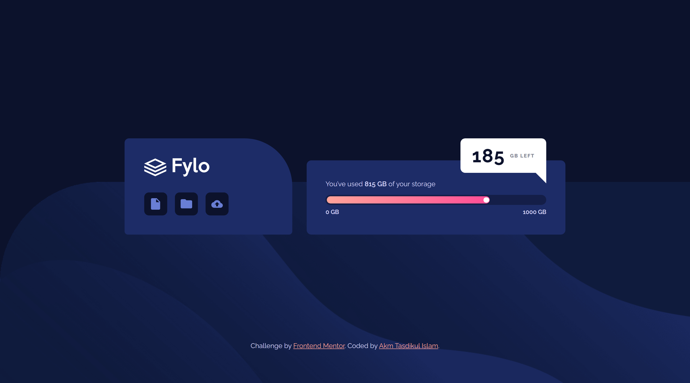
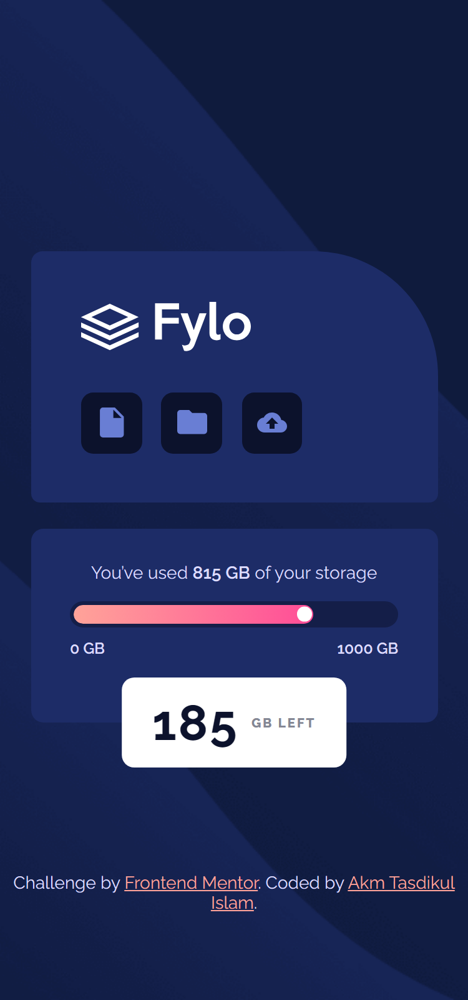

# Frontend Mentor - Fylo data storage component solution

This is a solution to the [Fylo data storage component challenge on Frontend Mentor](https://www.frontendmentor.io/challenges/fylo-data-storage-component-1dZPRbV5n). Frontend Mentor challenges help you improve your coding skills by building realistic projects.

## Table of contents

- [Overview](#overview)
  - [The challenge](#the-challenge)
  - [Screenshot](#screenshot)
  - [Links](#links)
- [My process](#my-process)
  - [Built with](#built-with)
  - [What I learned](#what-i-learned)
  - [Useful resources](#useful-resources)
- [Author](#author)

## Overview

- Project started on 02 May 2024
- Project duration: 03 Hours

Users should be able to:

- View the optimal layout for the site depending on their device's screen size

### Screenshot

| Desktop Version                        | Mobile Version                        |
| -------------------------------------- | ------------------------------------- |
|  |  |

### Links

- [Solution URL](https://github.com/akmtasdikulislam/fylo-data-storage-component)
- [Live Site URL](https://akmtasdikulislam.github.io/fylo-data-storage-component/)

## My process

- At first, I linked the `style.css` file and the Google Fonts CDN with `index.html`.
- Then, imported the colors from `style-guide.md` into the `style.css` file. After that, I initialized the css file and set necessary parameters (such as, font-families, colours, font-sizes etc.) for this project.
- Then, I wrote necessary code to reach the given _UI Design Sample_ and also added necessary css styles to match it with the _UI Design Sample_.
- Finally, I wrote the necessary CSS MEDIA QUERIES for mobile device view of this project.

### Built with

- Semantic HTML5 markup
- CSS custom properties
- Flexbox
- CSS Grid

### What I learned

By doing this project I learnt the followings:

- How to draw a \*right angle **Triangle\*** using CSS

```css
.storage_remaining::after {
  border-bottom: 0;
  border-left: 3em solid transparent;
  border-top: 3em solid white;
}
```

- How to make a progress-bar

```css
.progress-bar-bg {
  background-color: var(--slightly-dark-blue);
  border: 3px solid var(--slightly-dark-blue);
  border-radius: 1.25em;
  height: 1.5em;
  margin-bottom: 0.425em;
  margin-top: 2.4em;
  overflow: hidden;
  width: 100%;
}

.progress-bar-line {
  background: var(--gradient);
  border-radius: 1em;
  height: 100%;
  position: relative;
  width: 74.75%;
}

.progress-indicator-circle {
  background-color: white;
  border-radius: 50%;
  height: 0.82em;
  position: absolute;
  right: 0.1em;
  top: 50%;
  transform: translateY(-50%);
  width: 0.82em;
}
```

### Useful resources

- [How to Draw a Right-Angled Triangle with CSS | How to Draw CSS Shapes-Tutorial 6 | CSS Tutorials](https://www.youtube.com/watch?v=tTNxykEAPpA) - This helped me to draw a right angle triangle using css for the storage indicator tooltip's bottom part.
- [Drawing a triangle with CSS](https://alvaromontoro.com/blog/67970/drawing-a-triangle-with-css) - This helped me to draw a right angle triangle using css

## Author

- Frontend Mentor - [@akmtasdikulislam](https://www.frontendmentor.io/profile/akmtasdikulislam)
- Twitter - [@Akm_Tasdikul](https://www.twitter.com/Akm_Tasdikul)
